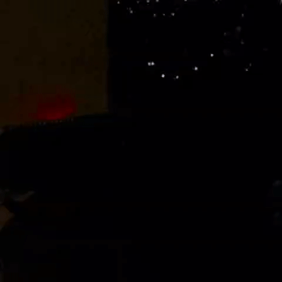

# Mehrabad FIDS
This repository contains codes for `ESP32 microcontroller` and `1602 LCD` with `IIC/I2C/TWI` for Mehrabad Flight Information Display System (`FIDS`).

The system displays flight information such as flight number, destination, and status on the LCD screen.

## Hardware

- ESP32 microcontroller
- 1602 LCD with IIC/I2C/TWI
- 5V Power source
- Remote server to deploy the Flask app

## Software
To use this system, first upload the `esp32-code.ino` file to your ESP32 microcontroller using Arduino IDE { [How This Code Work?](./docs/ESP32.md) }.

Then, serve the server files on your host and replace `serverName` with the URL of your server { [How To Run Server?](./docs/Server.md)  }.

By default, the script will loop every 25 seconds, which is customizable via timerDelay in the code.
However, decreasing this value may result in rate-limiting your client.

## Contribution
Contributions in the form of pull requests are welcome.

## License
This project is licensed under the WTFPL License.
